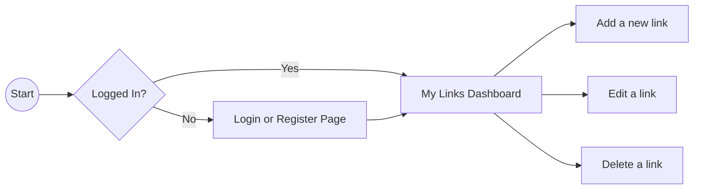

# Dev-Links 🚀

Hey! This is my 1st-year B.Tech project. It's a simple bookmarking tool where developers can save and organize their coding links.

---

## 🎨 My Rough Plan & Diagrams

Before coding, I made a rough plan of how things would connect. Here are some simple diagrams I made!

### How everything connects
Here is how the website talks to the backend and the database:
```mermaid
graph TD
    Frontend[Frontend (HTML, CSS, JS)]
    Backend[Backend (app.py with Flask)]
    Database[(Supabase PostgreSQL)]
    
    Frontend -- "Sends form data" --> Backend
    Backend -- "Saves or gets data" --> Database
    Database -- "Gives back data" --> Backend
    Backend -- "Sends data to screen" --> Frontend
```

### How the app works (User Flow)
Here is the path a user takes when they visit the site:


### Database Tables
I kept the database super simple. Just two tables!
```mermaid
erDiagram
    USERS {
        int id PK
        string username
        string password
    }
    LINKS {
        int id PK
        string title
        string url
        string tag
        int user_id FK
    }
    

---

## 🛠️ What I Used (Tech Stack)
- **Backend:** Python + Flask
- **Database:** Supabase (PostgreSQL) using psycopg2
- **Frontend:** Basic HTML, CSS (Flexbox), and Vanilla JavaScript
- *Note:* No React, no SQLAlchemy, just simple code!

---

## ⚙️ How to Run This Project

### Supabase Database Setup
1. Go to [Supabase](https://supabase.com) and make a free account.
2. Click **"New Project"**, name it, set a password, and pick a region.
3. Once it loads, go to **Settings > Database**.
4. Copy the **Connection String (URI format)** (it looks like `postgresql://...`).
5. Make a `.env` file in the folder and put your URL inside:
   `DATABASE_URL=your_connection_url_here`
6. Run this SQL in the Supabase SQL Editor to make the tables:

```sql
-- Create users table
CREATE TABLE users (
  id SERIAL PRIMARY KEY,
  username TEXT UNIQUE NOT NULL,
  password TEXT NOT NULL
);

-- Create links table
CREATE TABLE links (
  id SERIAL PRIMARY KEY,
  title TEXT NOT NULL,
  url TEXT NOT NULL,
  tag TEXT,
  user_id INTEGER REFERENCES users(id)
);
```

### Running Locally
1. **Install python packages:**
   ```bash
   pip install -r requirements.txt
   ```
2. **Start the server:**
   ```bash
   python app.py
   ```
3. **Open the app:** Go to your browser and type `http://127.0.0.1:5000`
